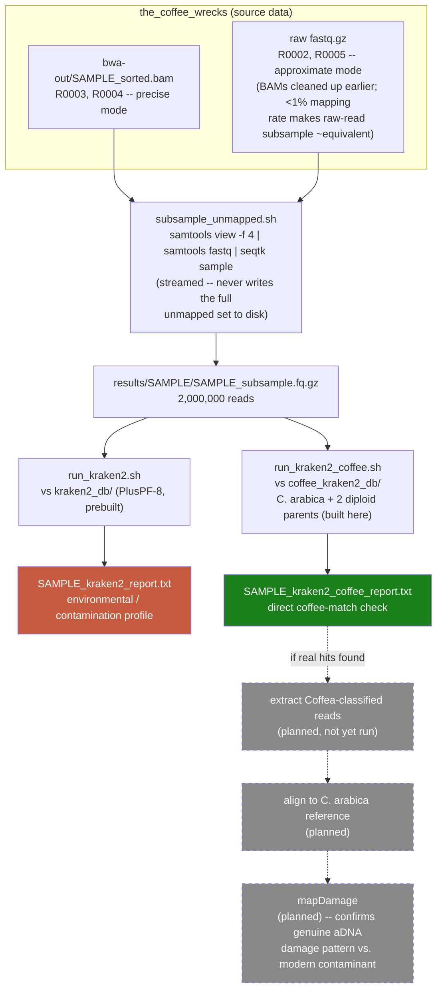

# Lab diary — metagenomic screening

Living log of this sub-project (screening the >99% of reads that don't align to *Coffea arabica* in `the_coffee_wrecks`). Newest entry first. Written to be portable into the coffee_wrecks dashboard.

## Pipeline so far

Two Kraken2 databases, two different questions: **PlusPF-8** (broad, prebuilt) asks "what environmental/microbial contamination is this?"; the **dedicated coffee database** (built here) asks "does any of it actually look like coffee?" directly — a blended single database couldn't answer the second question at all, since PlusPF-8 has no plant genomes in it.

## Genome sources (added to `coffee_kraken2_db/`)

*Coffea arabica* is a natural allotetraploid — a hybrid of two diploid species. All three genomes below are included so a read too divergent from the merged hybrid assembly can still match a parental subgenome cleanly.

| Species | Role | Accession | Assembly | Taxid | Source |
|---|---|---|---|---|---|
| *Coffea arabica* | the target, cv. ET-39 | [GCF_036785885.1](https://www.ncbi.nlm.nih.gov/datasets/genome/GCF_036785885.1/) | Coffea Arabica ET-39 HiFi | 13443 | RefSeq, PRJNA698600 (Coffee Consortium), already in `the_coffee_wrecks/ref_gen/` |
| *Coffea canephora* (Robusta) | diploid parent #1 | [GCA_036785865.1](https://www.ncbi.nlm.nih.gov/datasets/genome/GCA_036785865.1/) | ASM3678586v1, cv. DH200-94 | 49390 | GenBank, same PRJNA698600 project |
| *Coffea eugenioides* | diploid parent #2 | [GCF_003713205.1](https://www.ncbi.nlm.nih.gov/datasets/genome/GCF_003713205.1/) | Ceug_1.0 | 49369 | RefSeq reference genome, PRJNA497891 (Johns Hopkins University) |

All three MD5-verified against NCBI's published checksums before use. Taxids assigned explicitly via `kraken:taxid|<id>` FASTA header tags rather than accession lookup (avoids needing NCBI's much larger accession2taxid maps, which we don't use).

## 2026-09-19

- Ran the PlusPF-8 pass for R0003/R0004: **95.0–95.3% unclassified**; of the ~5% classified, dominated by sediment/soil/groundwater bacteria (*Rhodoferax sediminis*, *Bradyrhizobium*, *Rhodanobacter*, *Sphingomonadales*, *Mycobacterium*), plus a trace of human (0.14–0.18%, normal handling contamination). Nothing plant-like in the top 20 taxa for either sample — consistent with the contamination hypothesis, but PlusPF-8 has no plant genomes, so it couldn't have surfaced coffee DNA even if present in that unclassified 95%.
- Decided against extending PlusPF-8 in place: the downloaded prebuilt database ships only its compiled index, not the raw source library `kraken2-build --add-to-library` + `--build` needs to extend incrementally — doing so would have discarded the existing 8GB of reference data. Built a separate, dedicated `coffee_kraken2_db/` instead (see pipeline above).
- Two real bugs found and fixed while building this:
  - `subsample_unmapped.sh`'s "precise mode" wrote the *entire* unmapped-read set to disk (uncompressed) before subsampling — since ~99% of reads are unmapped, that's ~60–70GB per sample, and it filled the project's disk quota to 100% on the first run. Fixed to stream `samtools view -f 4 | samtools fastq | seqtk sample` straight through `/dev/stdin`, no large intermediate ever touches disk.
  - `run_kraken2.sh`'s trailing `sort | head -20` summary caused real, successful runs to report SLURM state `FAILED` — `head` closes the pipe after 20 lines, `sort` gets `SIGPIPE`, and `pipefail` treated that as a script failure despite the actual report having already been written correctly. Fixed with `|| true` on that display-only line.
  - `kraken2-build --download-taxonomy` uses `rsync`, which is blocked outbound network-wide on this cluster (confirmed from both the login node and inside an `sbatch` job — a protocol block, not a node-type restriction). Fixed by fetching NCBI's `taxdump.tar.gz` directly via `curl` over HTTPS instead (same host, same content, protocol Roihu does allow).
- Added `coffee_kraken2_db/` (this repo) with the 3 genomes above; ran classification against it for R0003/R0004: **559/2,000,000 (0.028%)** and **607/2,000,000 (0.030%)** reads respectively classified as *Coffea* (genus or species level) — every single classified hit landed inside *Rubiaceae*/*Coffea*, nothing scattered elsewhere in the tree. Interestingly more hits landed on *C. eugenioides* specifically than on *C. arabica* itself.
- Extracted those reads (`extract_coffee_hits.sh`) and aligned to the *C. arabica* reference with the same `bwa aln -l 16500 -n 0.01` as the base pipeline (`align_and_mapdamage.sh`): **0 of 559 / 0 of 607 aligned.** Investigated why directly rather than assuming a stringency issue:
  - Re-aligned the *C. arabica*-species-level subset (the strongest classification calls, n=39 for R0003) with `bwa mem` (local, soft-clip-tolerant) to see what they actually look like against the reference.
  - Most hits: long apparent matches (100–150bp) but with **NM 16–24** (11–16% mismatch) and **MAPQ 0** (tied with another location elsewhere in the genome) — not confident, specific matches; more consistent with repetitive-element noise that a short exact 35-mer k-mer match can trigger in Kraken2 without the rest of the read actually being a good match.
  - A handful of hits: short (40–61bp) but *near-perfect* (NM 0–1) partial matches, with the rest of the 150bp read soft-clipped. Investigated the clipped sequence directly rather than assuming adapter contamination: these are **simple sequence repeat / microsatellite regions** (`(ATG)n`, `(ATC)n` tandem repeats) — inherently low-complexity and not phylogenetically specific, so Kraken2 landing on *Coffea* here is weak evidence (these motifs recur genome-wide, not diagnostic of species). One example does show genuine 3′ adapter read-through (`...AGATCGGAAGAGC...`, the real Illumina adapter) following the repeat, but `fastp` couldn't auto-detect/trim it from only 39 reads, and it's on already-uninformative repeat sequence regardless.
  - **Conclusion: no meaningful pool of recoverable coffee signal in the unmapped fraction.** What classifies as *Coffea* breaks down into low-complexity repeats (not specific) and divergent/multi-mapping regions (not confident) — not missed genuine coffee DNA. `mapDamage` was not run since there's nothing aligned to compute a damage curve from; running it here would be meaningless, not merely underpowered.
- **Correction, same day, after building the CW_viz_pipeline report page for this data:** the "microsatellite repeat" call above was from eyeballing a 39-read subset. Re-checked properly on the *full* classified set (all 559 + 607 reads, both samples): re-aligned every read with `bwa mem` (not just the species-level subset), then chain-clustered the alignments by genomic position (≤500bp between neighbors) to see where they actually land. They are **not spread out** — 85.3% (R0003) / 84.0% (R0004) come back MAPQ 0, and the reads pile into a small number of narrow windows. Pulled the reference sequence at each of the 12 largest windows directly (`samtools faidx`) and checked it by eye rather than guessing again: **10 of the 12 are unambiguous bacterial 16S rRNA gene fragments**, not microsatellites — e.g. the `NC_092313.1:77046430` cluster (40 reads) opens with `AGAGTTTGATCCTGGCTCAG`, the universal bacterial 27F primer sequence; the `NC_092322.1:428273` cluster (46 reads, 100% MAPQ 0) contains the 515F primer target `CAGCCGCGGTAA`. The *same* 16S sequence recurs near-verbatim at multiple unrelated loci — several coffee nuclear chromosomes (`NC_092311.1`, `NC_092313.1`, `NC_092318.1`, `NC_092322.1`, `NC_092326.1`, `NC_092331.1`) *and* the mitochondrial contig (`NC_008535.1`, 3 separate windows). Revised mechanism: this is a highly conserved gene, present in the coffee reference assembly itself (plausibly bacterial-contamination sequence that made it into the draft assembly, or NUMT-like nuclear copies — not confirmed which), so an ordinary environmental-bacteria 16S read from the sample can pick up a stray "Coffea" k-mer hit purely from matching this shared conserved region. Doesn't change the bottom-line conclusion (still 0 aligned with the pipeline's own strict parameters, still no recoverable coffee signal) but is the actually-verified reason, not a guess. Full per-region table in `CW_viz_pipeline/metagenomic-data/coffee_hit_repeat_regions.json`, rendered on that repo's per-sample report pages. Not yet turned into a script here — run by hand on Roihu (`bwa mem` + `samtools faidx`), would need re-running manually for future samples.

## Answer to the original question

**The base pipeline's alignment excluded the >99% correctly.** It is not throwing away real, recoverable ancient coffee DNA:
- Of what Kraken2 can confidently classify at all (~5% against PlusPF-8), it's overwhelmingly sediment/soil bacteria consistent with an unenriched, shipwreck-recovered sample, plus a trace of normal human handling contamination.
- Of the small slice that classifies as *Coffea* specifically, direct read-level inspection shows it's overwhelmingly reads landing on a handful of bacterial 16S rRNA gene fragments duplicated in the coffee reference assembly (verified by pulling and reading the reference sequence directly, not low-complexity microsatellites as first guessed) plus some ambiguous multi-mapping regions — not genuine missed signal either way.
- The pipeline's very low final coverage (0.0014–0.004×, see `the_coffee_wrecks/PIPELINE.md`) is fully explained by sample properties (endogenous DNA rate, library complexity) established before this screening — nothing here points to a pipeline or alignment-parameter fix that would meaningfully change that.

## Summary

- Screened the >99% of reads that don't align to *Coffea arabica*, to determine whether it's contamination (expected) or missed real signal.
- Built two Kraken2 databases: PlusPF-8 (broad, prebuilt) for the contamination picture, and a dedicated 3-genome coffee database (built here, sources above) for a direct coffee-match check.
- Found and fixed 4 real infrastructure bugs along the way (disk-quota blowout from an unstreamed intermediate, a false-negative SIGPIPE job failure, an outbound rsync network block, and — via direct investigation rather than assumption — confirmed the coffee-classified hits pile up on bacterial 16S rRNA gene fragments duplicated in the reference assembly, not adapter contamination or microsatellite repeats as first suspected).
- **Answer: the exclusion was correct.** No meaningful additional coffee signal is being missed by the current alignment parameters.
