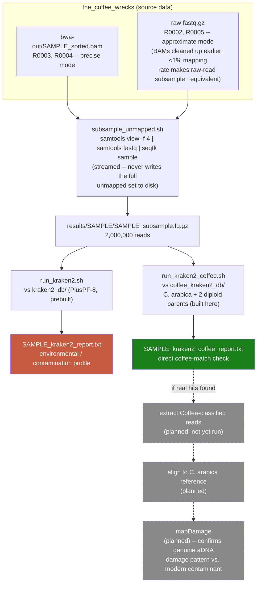

# Lab diary — metagenomic screening

Living log of this sub-project (screening the >99% of reads that don't align to *Coffea arabica* in `the_coffee_wrecks`). Newest entry first. Written to be portable into the coffee_wrecks dashboard.

## Pipeline so far

Two Kraken2 databases, two different questions: **PlusPF-8** (broad, prebuilt) asks "what environmental/microbial contamination is this?"; the **dedicated coffee database** (built here) asks "does any of it actually look like coffee?" directly — a blended single database couldn't answer the second question at all, since PlusPF-8 has no plant genomes in it.

## Genome sources (added to `coffee_kraken2_db/`)

*Coffea arabica* is a natural allotetraploid — a hybrid of two diploid species. All three genomes below are included so a read too divergent from the merged hybrid assembly can still match a parental subgenome cleanly.

| Species | Role | Accession | Assembly | Taxid | Source |
|---|---|---|---|---|---|
| *Coffea arabica* | the target, cv. ET-39 | [GCF_036785885.1](https://www.ncbi.nlm.nih.gov/datasets/genome/GCF_036785885.1/) | Coffea Arabica ET-39 HiFi | 13443 | RefSeq, PRJNA698600 (Coffee Consortium), already in `the_coffee_wrecks/ref_gen/` |
| *Coffea canephora* (Robusta) | diploid parent #1 | [GCA_036785865.1](https://www.ncbi.nlm.nih.gov/datasets/genome/GCA_036785865.1/) | ASM3678586v1, cv. DH200-94 | 49390 | GenBank, same PRJNA698600 project |
| *Coffea eugenioides* | diploid parent #2 | [GCF_003713205.1](https://www.ncbi.nlm.nih.gov/datasets/genome/GCF_003713205.1/) | Ceug_1.0 | 49369 | RefSeq reference genome, PRJNA497891 (Johns Hopkins University) |

All three MD5-verified against NCBI's published checksums before use. Taxids assigned explicitly via `kraken:taxid|<id>` FASTA header tags rather than accession lookup (avoids needing NCBI's much larger accession2taxid maps, which we don't use).

## 2026-09-19

- Ran the PlusPF-8 pass for R0003/R0004: **95.0–95.3% unclassified**; of the ~5% classified, dominated by sediment/soil/groundwater bacteria (*Rhodoferax sediminis*, *Bradyrhizobium*, *Rhodanobacter*, *Sphingomonadales*, *Mycobacterium*), plus a trace of human (0.14–0.18%, normal handling contamination). Nothing plant-like in the top 20 taxa for either sample — consistent with the contamination hypothesis, but PlusPF-8 has no plant genomes, so it couldn't have surfaced coffee DNA even if present in that unclassified 95%.
- Decided against extending PlusPF-8 in place: the downloaded prebuilt database ships only its compiled index, not the raw source library `kraken2-build --add-to-library` + `--build` needs to extend incrementally — doing so would have discarded the existing 8GB of reference data. Built a separate, dedicated `coffee_kraken2_db/` instead (see pipeline above).
- Two real bugs found and fixed while building this:
  - `subsample_unmapped.sh`'s "precise mode" wrote the *entire* unmapped-read set to disk (uncompressed) before subsampling — since ~99% of reads are unmapped, that's ~60–70GB per sample, and it filled the project's disk quota to 100% on the first run. Fixed to stream `samtools view -f 4 | samtools fastq | seqtk sample` straight through `/dev/stdin`, no large intermediate ever touches disk.
  - `run_kraken2.sh`'s trailing `sort | head -20` summary caused real, successful runs to report SLURM state `FAILED` — `head` closes the pipe after 20 lines, `sort` gets `SIGPIPE`, and `pipefail` treated that as a script failure despite the actual report having already been written correctly. Fixed with `|| true` on that display-only line.
  - `kraken2-build --download-taxonomy` uses `rsync`, which is blocked outbound network-wide on this cluster (confirmed from both the login node and inside an `sbatch` job — a protocol block, not a node-type restriction). Fixed by fetching NCBI's `taxdump.tar.gz` directly via `curl` over HTTPS instead (same host, same content, protocol Roihu does allow).
- Added `coffee_kraken2_db/` (this repo) with the 3 genomes above; classification against it for R0003/R0004 in progress.
- **Next planned**: if the coffee-database pass finds a meaningful number of reads confidently classifying as *Coffea*/*Rubiaceae* that were unclassified against PlusPF-8, extract those specific reads, align them to the *C. arabica* reference, and run `mapDamage` on the result. The point: genuine ancient DNA should show the same 5′ C→T / 3′ G→A deamination signature we've already confirmed elsewhere in this project (see `the_coffee_wrecks/PIPELINE.md`). If those reads show that damage pattern, it's real recovered signal; if they look like undamaged modern DNA, that points at a different explanation (e.g. a lab/reagent contaminant) rather than missed ancient coffee DNA.

## Summary so far

- The pipeline's very low final coverage (0.0014–0.004×, see `the_coffee_wrecks/PIPELINE.md`) is mostly explained by two things happening at/before alignment, not by anything lost during variant calling.
- Under 1% of raw reads ever map to *Coffea arabica*; of the ~99% that don't, at least the ~5% Kraken2 can confidently classify is overwhelmingly sediment/soil bacteria consistent with a shipwreck-recovered, non-enriched sample.
- Whether any real coffee signal is hiding in the remaining ~95% "unclassified" fraction is still open — PlusPF-8 structurally couldn't detect it (no plant genomes), which is why this dedicated coffee database exists.
- If the coffee-specific pass turns up genuine hits, `mapDamage` is the next step to confirm they're actually ancient rather than a fresh discovery of pipeline/lab contamination.
